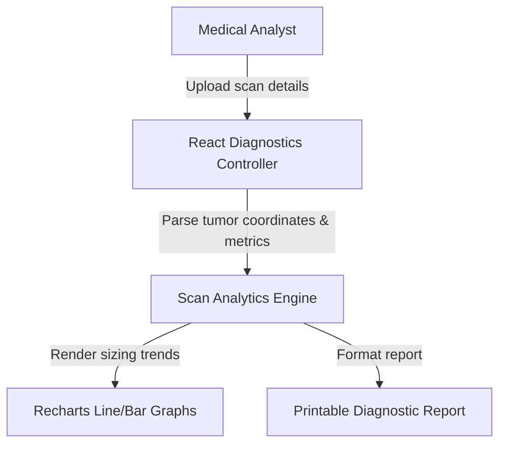

# NeuroScan: Diagnostic platform & Brain Tumor Telemetry Dashboard

<div align="center">
  
</div>

<div align="center">
    
</div>

منصة **NeuroScan** الطبية هي واجهة تشخيص تفاعلية مبنية في React مخصصة لعرض إحصائيات الكشف عن أورام الدماغ ومتابعة سجل الفحوصات الطبية للمرضى عبر إحصائيات بصرية دقيقة.

This repository holds the React frontend client and diagnostic telemetry interface for the **NeuroScan Tumor Detection Platform**. Built using Recharts to present diagnostic statistics.

---

## 🧬 Diagnostic Telemetry Flow

The platform handles scan parsing and renders charts dynamically:



---

## 🧬 UI Features & Modules

1.  **Diagnostics Telemetry Panel**: Custom charts presenting tumor sizes, growth timelines, and scans history.
2.  **Patients Database View**: List index sorting active scan reports.
3.  **Analytics Grid**: Interactive Recharts components detailing scan telemetry.

---

## 🛠️ Technology Stack & Assets

*   **Library**: **React 18** + **Vite**.
*   **Data Viz**: **Recharts** charting components.
*   **Styling**: High-contrast, clean interfaces built for medical systems.

---

## 📂 Repository Module Layout

```text
neuroscan-brain-tumor-detection-platform-react/
├── src/
│   ├── components/      # PatientList, TelemetryCharts, DiagnosticReport
│   ├── App.jsx          # Platform layout controller
│   └── main.jsx         # Render entry point
├── package.json         # Node metadata
└── README.md            # System documentation
```

---

## ⚡ Local Setup & Run
```bash
git clone https://github.com/Sayed-Herzallah/neuroscan-brain-tumor-detection-platform-react.git
cd neuroscan-brain-tumor-detection-platform-react
npm install
npm run dev
```

---

## 📄 License
Licensed under the **MIT License**.
